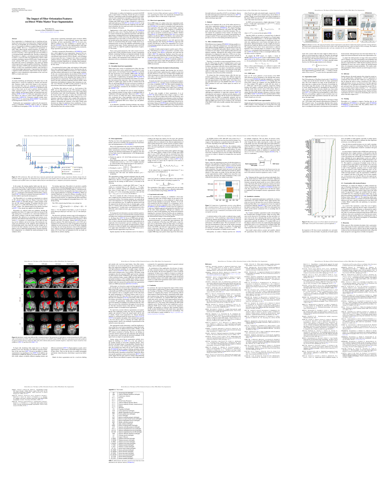

# TractSeg

This repository contains the code for the lab project "The Impact of Fiber Orientation Features on Direct White Matter Tract Segmentation". This project was developed within the lab "Visualization and Medical Image Analysis" at the University of Bonn during the winter semester 2023/2024.

TractSeg is a tool for fast and accurate white matter bundle segmentation from Diffusion MRI, as originally proposed by Wasserthal et al. For a documentation of TractSeg please refer to the [original code repository](https://github.com/MIC-DKFZ/TractSeg) and the following publications:

* [TractSeg - Fast and accurate white matter tract segmentation](https://doi.org/10.1016/j.neuroimage.2018.07.070) ([free arxiv version](https://arxiv.org/abs/1805.07103))
[NeuroImage 2018]
* [Combined tract segmentation and orientation mapping for bundle-specific tractography](https://www.sciencedirect.com/science/article/pii/S136184151930101X)
[Medical Image Analysis 2019]

The goal of this project is to investigate the role of local fiber orientation descriptors on a state-of-the-art direct segmentation method such as TractSeg. Please refer to the [final project report](./resources/report/The_Impact_of_Fiber_Orientation_Features_on_Direct_White_Matter_Tract_Segmentation.pdf).



## Installation

This code is designed for Linux systems.
It is known to run both on Ubuntu 22.04 with Python >= 3.9.
The installation is as simple as cloning this repository and running the prepared installation script:

```bash
git clone https://github.com/bertan-karacora/TractSeg.git
chmod +x ./install
./install
```

Finally, please adapt the contents of `tractseg/config.yaml` to setup the system paths.


## Training

1. Download and prepare the HCP data. Your data directory should contain at least the following files for each subject:

    ```
    .
    ├── subject_id/                                         # Subject ID
    │   ├── T1w_acpc_dc_restore_1.25.nii.gz                 # T1-weighted image
    │   ├── Diffusion/                                      # dMRI data
    │   │   ├── bvals                                       # b values (Diffusion weighting)
    │   │   ├── bvecs                                       # b vectors (Diffusion gradient directions)
    │   │   ├── data.nii.gz                                 # dMRI images
    │   │   ├── nodif_brain_mask.nii.gz                     # Binary brain mask
    │   └── ...
    └── ...
    ```  

2. Run the setup and data processing script. This will take a while and prepare all experiments.

    ```bash
    chmod +x scripts/setup_experiments
    scripts/setup_experiments
    ```

3. Create a custom experiment config or use one of the prepared ones under `tractseg/configs/custom/`.

4. Run:

    ```bash
    run_experiment --path_config_exp path/to/your/experiment-config --train --validate --test --segmentations
    ```

    You may want to have a look at additional arguments of this script.

5. Under the path that you have previously specified in `tractseg/config.yaml`, you will find the results.
